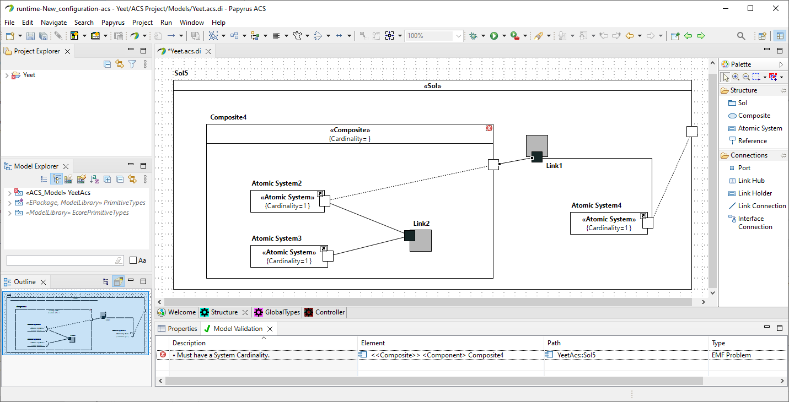

# The ACS Modeling Tool
The ACS methodology was initially published in [this article](https://ieeexplore.ieee.org/document/9497495) back in 2021, and in 2022, version "v0.99" of The ACS Modeling Tool was introduced in [this article](https://dl.acm.org/doi/10.1145/3550356.3559093) and quickly demonstrated in 5 minutes in [this video](https://www.youtube.com/watch?v=RT_9SuwAaRA). The current version is "v1.0" which improves on many things, including the appearance of ACS models. The work associated with this tool builds upon the initial release and also makes some substantial changes to the supported communication mechanisms and the type system. These changes to ACS and the results thereof are extensively described in [this project report](https://projekter.aau.dk/projekter/en/studentthesis/a-modeling-tool-for-system-of-systems(b51142c3-e698-41d2-bea6-716b8cc79461).html), which contains the most extensive description of ACS as of writing.

This tool facilitates communication-oriented modeling of system of systems. It loosely resembles UML and is built from UML using a profile and custom constraints. We extend Papyrus as that was the best-supported environment for building a diagrammatic, domain-specific modeling language.

## Documentation
The [wiki page](https://github.com/acs-modeling-tool/acs-modeling-tool/wiki) in this GitHub repository contains documentation about the following topics:

1. "[User guide](https://github.com/acs-modeling-tool/acs-modeling-tool/wiki/1.-User-guide)": Describes how to download, install, and use the pre-build releases of the tool, including a tutorial based on an example Library SoS.
2. "[Developer guide](https://github.com/acs-modeling-tool/acs-modeling-tool/wiki/2.-Developer-guide)": Describes how to set up a development environment for the tool, and what to be aware of while setting up the environment and during development.
3. "[Code structure](https://github.com/acs-modeling-tool/acs-modeling-tool/wiki/3.-Code-structure)": An overview of the code base.

## Notes on Eclipse Papyrus plugin development
The project is structured into plugins. Each plugin extends some functionality from Eclipse and Papyrus. Unfortunately, the documentation of plugins and classes in Papyrus is rather lacking. Small fixes can be made without understanding Papyrus and Eclipse but larger changes require a deeper understanding. It is strongly recommended to read the available Papyrus documentation.

After reading, look also at other existing projects to see how they accomplish their goals. These other projects have been essential in creating this project. Specifically recommended in no particular order is:

 - [Papyrus Robotics](https://git.eclipse.org/c/papyrus/org.eclipse.papyrus-robotics.git)
 - [Papyrus RT](https://git.eclipse.org/c/papyrus-rt/org.eclipse.papyrus-rt.git)
 - [Papyrus Opcua](https://github.com/model-UA/papyrus-opcua-plugin)
 - [Papyrus Library Example](https://github.com/bmaggi/library-training)
 - [Papyrus Umllight](https://github.com/eclipsesource/papyrus-umllight)
 - [Papyrus SysML](https://git.eclipse.org/c/papyrus/org.eclipse.papyrus-sysml16.git)

If this is your first Eclipse Papyrus plugin project, expect the learning curve to be steep, on the order of weeks/months rather than days, since the Eclipse/Papyrus framework is huge.

## License
Copyright 2022 ACS.
This project is part of ACS.
ACS is free software: you can redistribute it and/or modify it under the terms of the GNU General Public License version 3 as published by the Free Software Foundation. 
ACS is distributed in the hope that it will be useful, but WITHOUT ANY WARRANTY; without even the implied warranty of MERCHANTABILITY or FITNESS FOR A PARTICULAR PURPOSE. See the GNU General Public License for more details. 
You should have received a copy of the GNU General Public License along with ACS. If not, see [http://www.gnu.org/licenses/](http://www.gnu.org/licenses/ "http://www.gnu.org/licenses/").

## Contributors
 - Emil Palmelund Voldby 
 - Jonas Madsen
 - Sean Kristian Remond Harbo
 - Michele Albano
 
 
## Contact
Contact email may or may not be monitored. If you need access, try and reach one of the contributors.
 - acs-modeling-tool@protonmail.com
