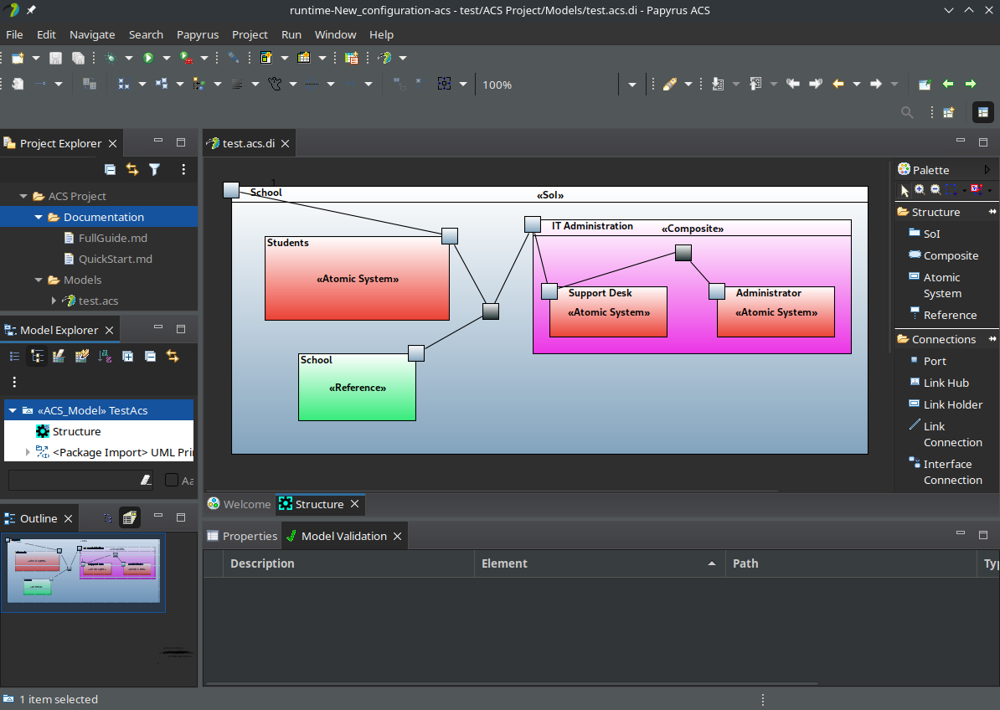

# The ACS Modeling Tool
ACS was initially published in [this article](https://ieeexplore.ieee.org/document/9497495) back in 2021, however, the work associated with this tool builds upon the initial release and also makes some substantial changes to the supported communication mechanisms and the type system. The syntax and semantics for ACS are available in the user documentation (see the "How to use" section). The syntax is also available in the UML Profile found in the profile plugin.

This tool facilitates communication-oriented modeling of system of systems. It loosely resembles UML and is built from UML using a profile and custom constraints. We extend papyrus as that was the best-supported environment for building a domain-specific modeling language.

## How to install

This repository provides zip files for each major operating system: Windows, Linux, and macOS.
Choose the zip file for your operating system and extract it anywhere you want.
Java 11 is required to run the IDE.

 1. Download the zip from the releases section.
 2. Extract the zip file.
 3. Run **papyrus-acs** executable.

## How to use
The user guide documentation is included in ACS. Simply **Download** -> **Run** -> **Create a new ACS project**. The user documentation will be included in a folder beside your models.
The plugin **org.eclipse.papyrus.acs.documentation** is responsible for building the documentation into the IDE so explore that plugin if you need the documentation and don't want to download the binary.
You can find the quick guide [here](./plugins/org.eclipse.papyrus.acs.documentation/documentation/quick.md)

## How to build
You can build the project using tycho-maven. The maven command: **clean verify** will compile the project and the associated artifacts.

## How to contribute
 1. Download and install Eclipse Modeling Tools. The last tested version was 2022-03 found [here](https://www.eclipse.org/downloads/packages/release/2022-03/r/eclipse-modeling-tools)
 2. Install papyrus in Eclipse Modeling Tools by going to **Help** -> **Install New Software...** and insert the update site link for Papyrus. The newest version can be found on the eclipse papyrus [website](https://www.eclipse.org/papyrus/download.html) but the latest tested version is: https://download.eclipse.org/modeling/mdt/papyrus/updates/releases/2022-03
 3. Install m2e in Eclipse Modeling Tools by going to **Help** -> **Eclipse Marketplace...**  search **"Eclipse m2e project"** and install the result titled **Eclipse m2e - Maven support in Eclipse IDE** read more [here](https://marketplace.eclipse.org/content/eclipse-m2e-maven-support-eclipse-ide)
 4. Clone this repository (i.e. this ACS IDE repository)
 5. Go To **File** -> **Open Projects From File System...** -> **Directory...** navigate to cloned directory and **Finish**
 6. Set Eclipse Modeling Tools to use **papyrus perspective** by clicking **open perspective** in the upper right corner
 7. In the **project explorer** Navigate to the **targetplatform file** under **releng** -> **org.eclipse.papyrus.acs.targetplatform** and open **org.eclipse.papyrus.acs.targetplatform.target**
 8. Click **Set Target Platform** (It might take some time to finish)
 9. Right Click anywhere in the **Project Explorer** -> **Run As** -> **Run Configurations...**
 10. Choose the configuration **Eclipse Application** -> **Run**  and click **Run**

If successful, ACS should open (might take some time) as compiled directly from the source code.

Make a pull request or fork this repository, both are fine by me.

### Notes
The project is structured in plugins. Each plugin extends some functionality from Eclipse and Papyrus.
Unfortunately, the documentation of plugins and classes in Papyrus is rather poor/outdated.
Small fixes can be made without understanding Papyrus and Eclipse but larger changes require a deeper understanding.
It is strongly recommended to read the available Papyrus documentation (even the outdated stuff) since there is not much of it.

After reading, look also at other existing projects to see how they accomplish their goals. These other projects have been essential in creating this project. Specifically recommended in no particular order is:

 - [Papyrus Robotics](https://git.eclipse.org/c/papyrus/org.eclipse.papyrus-robotics.git)
 - [Papyrus RT](https://git.eclipse.org/c/papyrus-rt/org.eclipse.papyrus-rt.git)
 - [Papyrus Opcua](https://github.com/model-UA/papyrus-opcua-plugin)
 - [Papyrus Library Example](https://github.com/bmaggi/library-training)
 - [Papyrus Umllight](https://github.com/eclipsesource/papyrus-umllight)
 - [Papyrus SysML](https://git.eclipse.org/c/papyrus/org.eclipse.papyrus-sysml16.git)

If this is your first project, expect the learning curve to be steep, on the order of weeks/months rather than days, since the Eclipse/Papyrus framework is huge.

### License
Copyright 2022 ACS
This project is part of ACS
ACS is free software: you can redistribute it and/or modify it under
the terms of the GNU General Public License as published by the
Free Software Foundation, either version 3 of the License, or (at your option)
any later version. 
ACS is distributed in the hope that it will be useful, but WITHOUT
ANY WARRANTY; without even the implied warranty of MERCHANTABILITY
or FITNESS FOR A PARTICULAR PURPOSE. See the GNU General
Public License for more details. 
You should have received a copy of the GNU General Public License along
with ACS. If not, see [http://www.gnu.org/licenses/](http://www.gnu.org/licenses/ "http://www.gnu.org/licenses/").

### Contributors
 - Emil Palmelund Voldby 
 - Jonas Madsen
 - Sean Kristian Remond Harbo
 - Michele Albano
 
### Contact

Contact email may or may not be monitored. If you need access, try and reach one of the contributors.
 - acs-modeling-tool@protonmail.com
